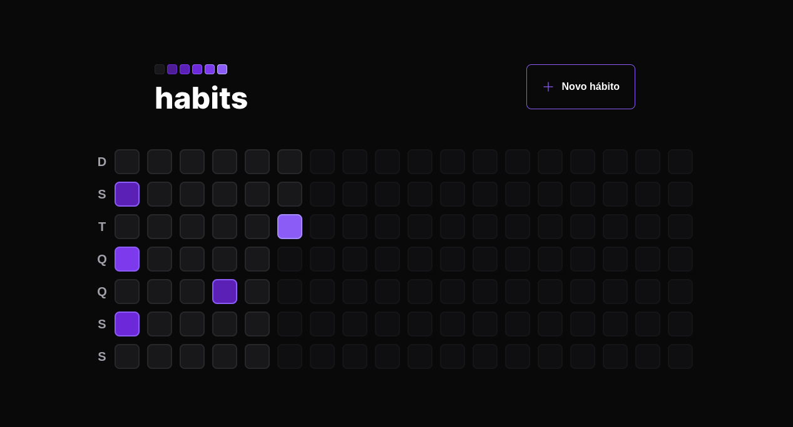
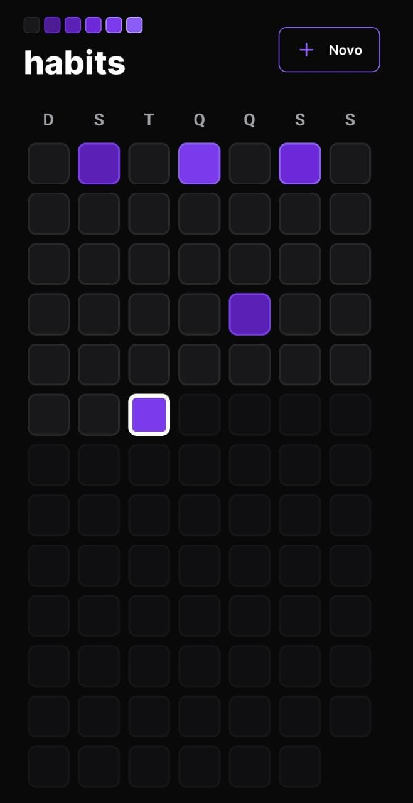

# Habits :muscle:




## :page_with_curl: About/Sobre

<details>
  <summary markdown="span"><strong>:us: English</strong></summary><br />

FullStack project developed by [Gustavo da Silva](https://www.linkedin.com/in/gustavocdn/) during the first Rocketseat NLW of 2023.

This application is a Habit Tracker where the user can register daily habits and make control of the habits fulfilled during the day. A Web and Mobile version was developed.
<br />

</details>
<details>
  <summary markdown="span"><strong>:brazil: Português</strong></summary><br />

Projeto FullStack desenvolvido por [Gustavo da Silva](https://www.linkedin.com/in/gustavocdn/) durante a primeira NLW da Rocketseat de 2023.

Essa aplicação é um Habit Tracker onde o usuario pode cadastrar habitos diarios e fazer controle dos habitos cumpridos durante o dia. Foi desenvolvida uma versão Web e Mobile.
<br />

</details>

## :man_technologist: Developed Skills/Habilidades Desenvolvidas

<details>
  <summary markdown="span"><strong>:us: English</strong></summary><br />

- React Native
- API creation with Fastify.
- mysql queries
- Problem Solving
<br />
</details>

<details>
  <summary markdown="span"><strong>:brazil: Português</strong></summary><br />

- React Native
- Criação de API com Fastify.
- MySQL Queries
- Resolução de Problemas
<br />
</details>

## :hammer_and_wrench: Tools/Ferramentas

- NodeJS
- Typescript
- Fastify
- Prisma
- React + React Native
- MySQL

## :rocket: How to run/Como rodar

<details>
  <summary markdown="span"><strong>:us: English</strong></summary><br />
    
<details open>
<summary markdown="span"><strong>:computer: Local</strong></summary><br />
            
**1 - Clone the repository and enter the project folder**
            
```bash
git clone git@github.com:gusttavocdn/habits_tracker.git && cd habits_tracker
```

**2 -Install dependencies and run Apps**

```bash
cd server && npm run dev
cd web && npm run dev
cd mobile && npm start
```

</details>

<br>
</details>

<details>
  <summary markdown="span"><strong>:brazil: Português</strong></summary><br />

  <details open>
   <summary markdown="span"><strong>:computer: Local</strong></summary><br />
    
   **1 - Clone o repositório e entre na pasta do projeto**
    
   ```bash
    git clone git@github.com:gusttavocdn/habits_tracker.git && cd habits_tracker
   ```
   **2 - Inicie um ambiente virtual e faça instalação das dependencias**
        
  ```bash
cd server && npm run dev
cd web && npm run dev
cd mobile && npm start
```

  </details>
</details>

<!-- ## :trophy: Grade/Nota -->
